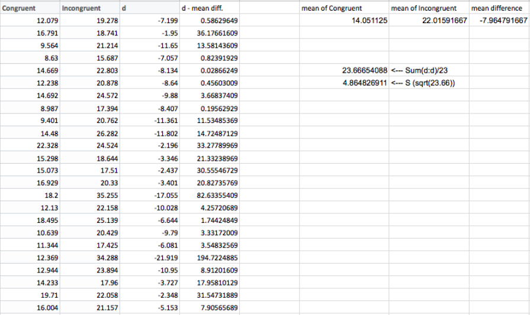

##Questions For Investigation


###1. What is our independent variable? What is our dependent variable?

Our independent variables are word's meaning and word's color, dependent variable is time.


###2. What is an appropriate set of hypotheses for this task? What kind of statistical test do you expect to perform? Justify your choices.


H0: There is no difference in population means of response time under incongruent and congruent scenarios<br/>
$\begin{aligned}   \mu_c = \mu_i \end{aligned}$ , $\begin{aligned} \mu_c \end{aligned}$ is mean of congruent population and  $\begin{aligned} \mu_i \end{aligned}$ is mean of incongruent population
<br/>
<br/>
H1 : The population mean of the response time under incongruent scenarios is different from congruent scenarios<br/>
$\begin{aligned} \mu_c \ne \mu_i \end{aligned}$ 
<br/>
<br/>
We have two particular samples,<br/> 
we need to compare two sample means,<br/>
we don't know population mean and standart deviation.<br/>

So I use two-tailed t-test for paired sample for this.


###3. Report some descriptive statistics regarding this dataset. Include at least one measure of central tendency and at least one measure of variability.

When we look at the summary of datas we can see that mean and median is close each other, so we can say that both distrubition is normal distributed. 

Central tendencys ( mean, meadian ) and measure of variability ( IQR, range) like below ;

<pre>
<b>Congruent :</b>

 Minimum value  :8.63
 Maximum value  :22.33
 Median         :14.36 
 Mean           :14.05
 std.dev        :3.56
 1st Qu.        :11.90 
 3rd Qu.        :16.20 
 IQR            :4.3
 lower - upper (Q1 - 1.5*IQR , Q3+1.5*IQR) : (5.45, 22.25)
 
<b>Incongruent :</b>

 Minimum value  :15.69 
 Maximum value  :35.26
 Median         :21.02 
 Mean           :22.02
 std.dev        :4.80
 1st Qu.        :18.72
 3rd Qu.        :24.05 
 IQR            :5.33
 lower - upper  (Q1 - 1.5*IQR , Q3+1.5*IQR) : (13.39, 29.38)
</pre>  


###4. Provide one or two visualizations that show the distribution of the sample data. Write one or two sentences noting what you observe about the plot or plots.

```{r graphs1,warning=FALSE,echo=FALSE}

library(ggplot2)

stroopData <- read.csv("stroopdata.csv")

ggplot(stroopData,aes(x=Congruent))+
  geom_histogram( aes ( y=..density..),binwidth = 2,fill = 'orange', colour = 'black' )+
  scale_x_continuous(breaks = seq(0,40,by=2) , labels = seq(0,40,by=2) )+
  geom_vline(aes(xintercept=mean(Congruent, na.rm=T)),   # Ignore NA values for mean
               color="red", linetype="dashed", size=1)+
  geom_density(alpha=.2, fill="blue")+
  ggtitle('Congruent Histogram')


```


Congurent distribution is normal distrubuted, means of this distribution is 14.05


```{r graphs2,warning=FALSE,echo=FALSE}

ggplot(stroopData,aes(x=Incongruent))+
  geom_histogram( aes ( y=..density..),binwidth = 1.6,fill = 'orange', colour = 'black' )+
  scale_x_continuous(breaks = seq(0,40,by=2) , labels = seq(0,40,by=2) )+
  geom_vline(aes(xintercept=mean(Incongruent, na.rm=T)),   # Ignore NA values for mean
               color="red", linetype="dashed", size=1)+
  geom_density(alpha=.2, fill="blue")+
  ggtitle('Incongruent Histogram')


```


Incongurent distribution is bimodal distrubuted, means of this distribution is 22.02


Also if we remove the outliers from these distributions ;


```{r graphs3,warning=FALSE,echo=FALSE}


ggplot(stroopData,aes(x=Congruent))+
  geom_histogram( aes ( y=..density..),binwidth = 2,fill = 'orange', colour = 'black' )+
  scale_x_continuous(breaks = seq(0,40,by=2) , labels = seq(0,40,by=2) ,limits = c(5,22))+
  geom_vline(aes(xintercept=mean(Congruent, na.rm=T)),   # Ignore NA values for mean
               color="red", linetype="dashed", size=1)+
    geom_vline(aes(xintercept=median(Congruent, na.rm=T)),   # Ignore NA values for mean
               color="blue", linetype="dashed", size=1)+
  geom_density(alpha=.2, fill="blue")+
  ggtitle('Congruent Histogram without OUTLIERS')


```

it seems normal distrubuted, blue line is median and red line is mean of distribution.

```{r graphs4,warning=FALSE,echo=FALSE}

ggplot(stroopData,aes(x=Incongruent))+
  geom_histogram( aes ( y=..density..),binwidth = 1.6,fill = 'orange', colour = 'black' )+
  scale_x_continuous(breaks = seq(0,40,by=2) , labels = seq(0,40,by=2),limits = c(13,29) )+
  geom_vline(aes(xintercept=mean(Incongruent, na.rm=T)),   # Ignore NA values for mean
               color="red", linetype="dashed", size=1)+
    geom_vline(aes(xintercept=median(Incongruent, na.rm=T)),   # Ignore NA values for mean
               color="blue", linetype="dashed", size=1)+
  geom_density(alpha=.2, fill="blue")+
  ggtitle('Incongruent Histogram without OUTLIERS')


```


As we can see this non-outliered distribution is normal distribution too.And blue line is median and red line is mean of this distribution.

According to this sample data , we can easily say that Incongurent test takes more time that congruent test.


###5. Now, perform the statistical test and report your results. What is your confidence level and your critical statistic value? Do you reject the null hypothesis or fail to reject it? Come to a conclusion in terms of the experiment task. Did the results match up with your expectations?


a = 0.05<br/>
it is 95 percent confidence level<br/>
sample size = 24  so df = 23<br/>

two tailed 0.05 and 23 ;

$\begin{aligned}  P = +-2.069  \end{aligned}$
and<br/>
t* = -2.069  and  t* = 2.069
<br/>
Mean of Congruent sample ,   Mc = 14.051125<br/>
Mean of Incongruent sample , Mi = 22.015916<br/>

and step by step ;
<pre>
1 - Calculate the Differences (Congruent - Incongruent) of each test
2 - Calculate the squared deviations difference - ((Differences of Congruent and Incongruent)-Mean difference)^2
3 - Sum the squared deviations difference : 
4 - Divide it by the number of samples - 1 which is equals to the Variance Difference :23.66654088
5 - Square root the Variance Difference : 4.864826911
</pre>

</img>
<br/>
<br/>
<br/>
according to the dependent t-test for paired sample ; <br/>
$\begin{aligned} S_d = \sqrt{\left(\frac{\sum(d -(\mu_c - \mu_i)}{n-1}\right)}\end{aligned}$

S : 4.864826911<br/>
n : 24

$\begin{aligned} t = \left(\frac{\mu_c - \mu_i}{ \frac{S}{\sqrt{n}} }\right)\end{aligned}$


t = (14.051125 - 	22.015916 ) / ( 4.8648 / 4.8989 )<br/>
t = -8.02 <br/>

Result : reject to null , t value is significently low

####Conclusion

  First of all we found dependent variable, time interval is dependent variable and it depends on words meaning and its color. According to the data I've appropriated a hypothesis and to test this hyphothesis, Because of we have dependent variable and two sets, I've choosed dependent t-test.<br/>
  Choosing critical zone is 5% ( a = 0.05 ), I've calculate mean of samples, according to alpha and deep of freedom values, found P values. and I've calculated t value.<br/>
Calculated t value is in critical zone in distribution so null hypothesis has been rejected.

  
####Referances

* http://www.stat.cmu.edu/~cshalizi/rmarkdown/  
* https://statistics.laerd.com/statistical-guides/dependent-t-test-statistical-guide.php
* http://www.stat.cmu.edu/~cshalizi/rmarkdown/
* http://onlinestatbook.com/2/summarizing_distributions/variability.html


